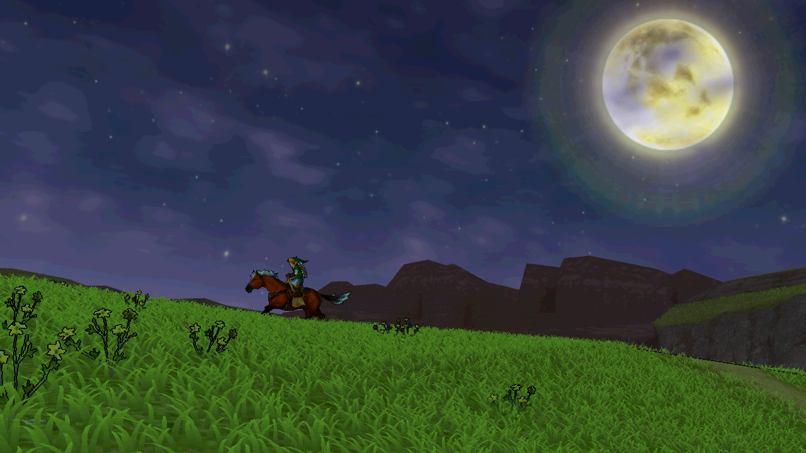
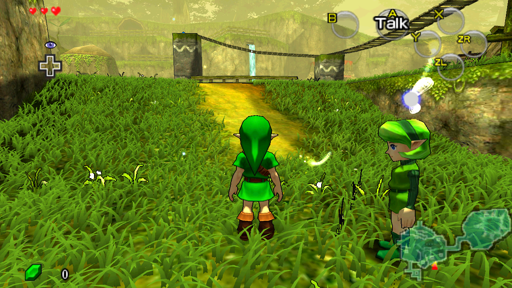
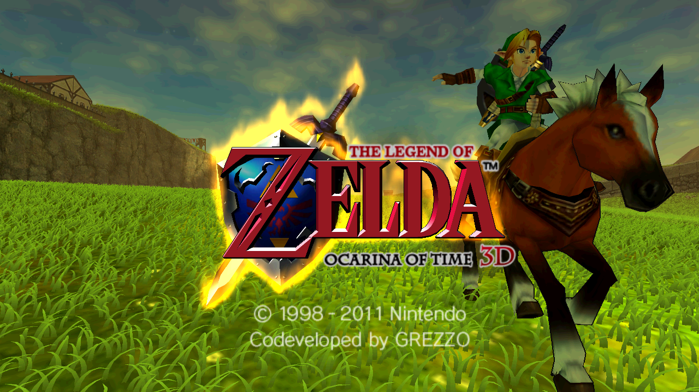

# TriAevum

A native PC AOT recompilation of *The Legend of Zelda: Ocarina of Time 3D*,
with a modern NRI/Vulkan renderer, single-screen UI and customizable graphics.

## Credit Where It Belongs

Before the shaders, settings and excessive grass: **TriAevum would not exist in
its current form without [TopScreen](https://gamebanana.com/mods/695893),
developed by rlgcarrot**. Its single-screen experience is reimplemented here for
our runtime, but the vision, care and tremendous work behind it deserve a
special thank-you. Please consider [buying rlgcarrot a coffee](https://ko-fi.com/rlgcarrot)
to support that fantastic work.

Just as essential are **Azahar, Ship of Harkinian, libultraship, NVIDIA NRI**,
and the SDL controller-mapping community. And, of course, **Nintendo and
Grezzo**, who created the original game. [Full credits and licenses](THIRD_PARTY_NOTICES.md).

**[Download v0.6.0-alpha.1c for Windows x64](https://github.com/coccofresco/TriAevum/releases/tag/v0.6.0-alpha.1c)**

## About

TriAevum is an AOT recomp in the same general spirit as the Xbox 360 recomp
projects. I just ended up spending most of my time on the renderer instead of,
you know, actually playing the game. The goal is to push the visuals further
without completely losing the original look.

**Development of this project is entirely AI-assisted, under human direction.**
That describes the TriAevum-specific work, not the mature donor projects and
libraries it builds on: Azahar, Ship of Harkinian, NRI and others. Aside from
those foundations, you could fairly call this concentrated AI slop.
Apparently, even AI slop can still consume several months of your life.

## Install

Requires Windows x64, a Vulkan-capable GPU with current drivers, and your own
supported decrypted ROM. Forge accepts `.3ds` and `.cci` and checks the contents,
not just the filename.

It should work with any personal EUR or USA ROM dump, provided it is decrypted
and in `.cci` or `.3ds` format.
See [ROM compatibility details](docs/TRIAEVUM_CONTENT_FAMILY_IMPORT.md).

1. Download the **Windows-x64 ZIP**, not GitHub's source-code archive, and
   extract it into a writable folder.
2. Run `TriAevumForge.exe` and select your decrypted ROM.
3. When setup finishes, choose **Launch game**. Afterwards, use `TriAevum.exe`.

No compiler or SDK is needed. Forge downloads the official TopScreen texture
package during setup; an Internet connection is required unless that package
is [provided locally](docs/TRIAEVUM_TOPSCREEN_INSTALLATION.md). No ROM or original
game assets are included. Keep and back up `data/`: it holds your saves,
settings and locally prepared game data.

## Graphics and controls

- Cel/toon shading and outlines.
- Ambient occlusion, plus optional reflections, shadows and anti-aliasing.
- Real widescreen framing and configurable field of view.
- **60/90 FPS visual interpolation** of the original 30 Hz game state.
  Game logic and gameplay speed remain unchanged; this is not 60/90 Hz physics.
- Azahar-compatible custom textures and texture dumping.
- Reimplemented **TopScreen** single-screen HUD and menus.
- Configurable gameplay free camera, keyboard/mouse and controller inputs.
- Named settings profiles, audio and save states.
- Procedural grass. A lot of grass. Possibly too much grass.

Press **F1** for settings. **F2** temporarily disables the main added graphics
effects, then restores them without losing your configuration. Most of the
presentation is configurable, so if my artistic decisions offend you
personally, you can probably undo them. Effects can be expensive; adjust them
to suit your GPU.

## Testing and contributing

This is an **experimental alpha**, not a fully tested port. Gameplay testing
currently covers the early parts of the game. The USA adapter has been checked
through installation, the title intro and file selection, not a full playthrough.
I find tweaking shaders considerably more entertaining than finishing Zelda
again, so people willing to actually play through it are especially welcome.

Please [report issues](https://github.com/coccofresco/TriAevum/issues) with the
version, ROM input/revision, GPU/driver, settings and steps to reproduce.
**Normal in-game save files are particularly useful for problems later in the
game.** Review logs for personal information before sharing; do not upload
ROMs, extracted assets or memory savestates containing game code.

Contributions, experiments and forks taking the renderer in other directions
are welcome. Longer term, I would like to explore a proper ray-tracing path
and finish features still in the traditional state known as "technically
implemented". Ray tracing is a wishlist item, not a feature of this release.

[Release notes and known limitations](docs/releases/v0.6.0-alpha.1b.md).

## Screenshots

Captured with the default profile: toon shading, outlines, grass, 1.10x FOV,
x2 interpolation and TopScreen. No additional HD texture pack.

## Source and license

Original contributions are licensed under **GPL-3.0-or-later**. Third-party
components retain their own licenses and notices:
[license scope](LICENSE_SCOPE.md) and [third-party notices](THIRD_PARTY_NOTICES.md).
See the [release and build contract](docs/TRIAEVUM_PRECOMPILED_RELEASE.md) for
source availability and developer packaging.

TriAevum is independent and is not affiliated with or endorsed by Nintendo.

Worst case scenario, at least we got more grass.
